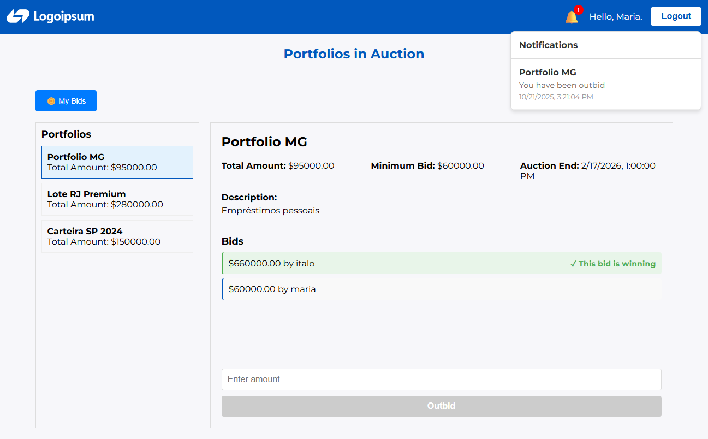
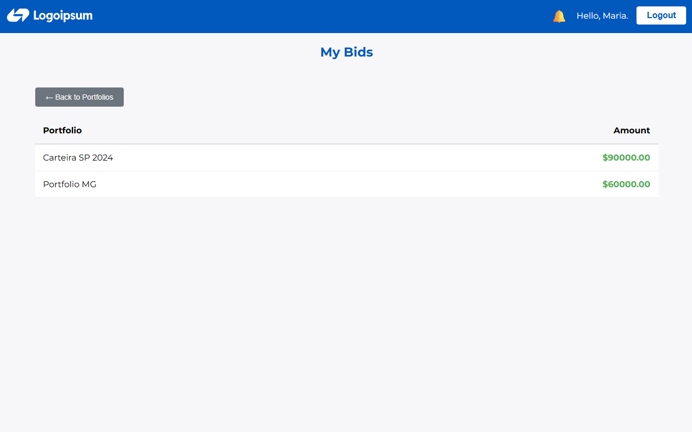

# 📊 Debt Portfolio Auction - Complete Technical Documentation

<div align="center">
    
    
    
</div>

<table align="center">
  <tr>
    <td align="center">
      
    </td>
    <td align="center">
      
    </td>
  </tr>
</table>

---

## 🎯 Overview

This monorepo contains the source code for a complete web system for auctioning debt portfolios, allowing users to place real-time bids with automatic notifications and responsive interface. The project was built as a monorepo containing backend (Django) and frontend (Next.js). It uses:

- ✅ JWT authentication with automatic refresh token
- ✅ Real-time bidding system via WebSockets (Django Channels)
- ✅ Automatic notifications (outbid, closing soon, win/loss)
- ✅ Bulk portfolio upload and processing via CSV (Celery)
- ✅ Administrative dashboard
- ✅ RESTful API documented with Swagger/OpenAPI
- ✅ Automated tests with CI/CD
- ✅ Containerized deployment with Docker

## 🛠 Tech Stack

### **Backend**

| Technology | Purpose |
|------------|---------|
| **Python** | Base language |
| **Django** | Main web framework |
| **Django REST Framework** | RESTful API |
| **Daphne** | ASGI server for WebSockets |
| **Django Channels** | Real-time WebSockets |
| **Celery** | Asynchronous processing and scheduled tasks |
| **Redis** | Message broker (Celery) and Channel Layers |
| **SQLite** | Database (development) |
| **JWT** | Stateless authentication |
| **drf-spectacular** | OpenAPI/Swagger documentation |
| **django-environ** | Environment variables management |
| **django-cors-headers** | CORS |

### **Frontend**

| Technology | Purpose |
|------------|---------|
| **Next.js** | React framework with SSR |
| **React** | UI library |
| **Axios** | HTTP client with interceptors |
| **WebSocket API** | Real-time connections |

### **DevOps**

| Technology | Purpose |
|------------|---------|
| **Docker** | Containerization |
| **Docker Compose** | Container orchestration |
| **Nginx** | Reverse proxy and static file serving |
| **GitHub Actions** | CI/CD pipeline |

---

## 🏗 System Architecture

```
┌─────────────────────────────────────────────────────────────────┐
│                         NGINX:80 (Proxy)                        │
│  - Request routing                                              │
│  - Serving static files                                         │
│  - WebSocket upgrade support                                    │
└────────────┬────────────────────────────────────┬───────────────┘
             │                                    │
             ▼                                    ▼
    ┌────────────────┐                  ┌────────────────────┐
    │  Frontend:3000 │                  │   Backend:8000     │
    │   (Next.js)    │◄─────API─────────│  (Django/Daphne)   │
    │                │                  │                    │
    │  - SSR/CSR     │                  │  - REST API        │
    │  - WebSocket   │◄─────WS──────────│  - WebSockets      │
    │  - Axios       │                  │  - ASGI            │
    └────────────────┘                  └─┬──────────────────┘
                                          │
           ┌──────────────────────────────┼──────────────┐
           │                              │              │
           ▼                              ▼              ▼
       ┌─────────────────┐      ┌────────────────┐  ┌──────────┐
       │ Celery Worker   │      │   Redis:6379   │  │  SQLite  │
       │                 │      │                │  │          │
       │ - CSV Import    │─────►│ - Celery Broker│  │ - Data   │
       │ - Notifications │      │ - Channel Layer│  │  Storage │
       └─────────────────┘      └────────────────┘  └──────────┘
```

## 🔐 Security and Permissions

### Endpoints Permission Matrix

| Endpoint | Anonymous | Authenticated (All) | Owner | Admin |
|----------|-----------|---------------|-------|-------|
| `POST /api/users/register/` | ✅ | 🔵 | 🔵 | 🔵 |
| `POST /api/users/token/` | ✅ | ✅ | ✅ | ✅ |
| `GET /api/portfolios/actives/` | ❌ | ✅ | ✅ | ✅ |
| `POST /api/bids/actives/` | ❌ | ✅ | ✅ | ✅ |
| `PUT /api/bids/{id}/` | ❌ | ❌ | ✅ | ✅ |
| `GET /api/bids/user/` | ❌ | ❌ | ✅ | ✅ |
| `POST /api/portfolios/` | ❌ | ❌ | ❌ | ✅ |
| `POST /api/portfolios/upload-csv/` | ❌ | ❌ | ❌ | ✅ |
| `GET /api/bids/` | ❌ | ❌ | ❌ | ✅ |

### Business Rules Enforced

- ✅ Only authenticated users can place bids
- ✅ Cannot create bid on inactive portfolio
- ✅ Cannot update bid on closed portfolio
- ✅ Amount must be (>= minimum_bid) or (> current highest bid)
- ✅ unique_together (1 bid per user/portfolio)
- ✅ Only owner can edit own bid

---

## 🐳 DevOps and CI/CD

This project leverages Docker for consistent and isolated deployment environment, making it easy to run the application anywhere. Docker Compose is used to orchestrate all services (backend, frontend, Redis, and Nginx).

For quality assurance, a CI pipeline is configured using GitHub Actions, which automatically runs Django tests.

## 🔗 Useful Links

- **Swagger API Docs**: http://localhost/api/docs/
- **Django Admin**: http://localhost/admin (admin/admin)
- **Frontend**: http://localhost
- **GitHub Repository**: https://github.com/icarogabryel/dept-portfolio-auction

---

```
## 📂 Project Tree

dept-portfolio-auction/
├── 🧰 .github/
├── 🧱 backend/
│ ├── 🧩 apps/
│ ├── ⚙️ config/
│ ├── 🎨 staticfiles/
│ ├── 📤 uploads/
│ ├── ⛰️ venv/
│ ├── 📜 manage.py
│ ├── 🐳 Dockerfile
│ ├── 📦 requirements.txt
│ ├── 🧾 entrypoint.sh
│ ├── 🧱 db.sqlite3
│ ├── 🐳 .dockerignore
│ ├── ⛰️ .env.example
│ ├── ⛰️ .env
│ └── 😺 .gitignore
├── 📚 docs/
├── 💻 frontend/
│ ├── ⬛ .next/
│ ├── 🌍 public/
│ ├── 🧾 src/
│ │ ├── 🧩 app/
│ │ ├── 🧩 components/
│ │ ├── 🪝 hooks/
│ │ ├── 🎨 layouts/
│ │ └── 🔧 services/
│ ├── 📦 node_modules/
│ ├── 🐳 .dockerignore
│ ├── ⛰️ .env.example
│ ├── ⛰️ .env
│ ├── 😺 .gitignore
│ ├── 🐳 Dockerfile
│ ├── 📜 eslint.config.mjs
│ ├── ⚙️ next.config.mjs
│ ├── 📦 package.json
│ ├── 📦 package-lock.json
│ └── 🧾 jsconfig.json
├── 🌐 nginx/
│ └── ⚙️ nginx.conf
├── 🧰 scripts/
│ └── 🧾 install_dev.sh
├── 😺 .gitignore
├── 🐋 docker-compose.yml
├── 📘 LICENSE.txt
└── 🧭 README.md
```

---

## ⬇️ Installation in Development Environment

1. Clone the repository:

   ```bash
   git clone https://github.com/icarogabryel/dept-portfolio-auction.git
   cd dept-portfolio-auction
   ```

2. Copy the example environment to create your own `.env` file:

   ```bash
   cp backend/.env.example backend/.env
   ```

   ```bash
    cp frontend/.env.example frontend/.env
    ```

3. Install Redis if not already installed:

   ```bash
   sudo apt update
   sudo apt install redis-server -y
   ```

4. Run the installation script:

   ```bash
   source scripts/install_dev.sh
   ```

5. Create a superuser for admin access:

   ```bash
   cd backend
   python3 manage.py createsuperuser
   ```

6. Start the development servers:
    Open three terminal tabs.

    In the first terminal, make sure Redis is running (Automatically starts on installation, but you can start it manually if needed):

    ```bash
    redis-server
    ```

    In the second terminal, start the Django development server:

    ```bash
    cd backend
    python3 manage.py runserver
    ```

    In the third terminal, start the React development server:

    ```bash
    cd frontend
    npm run dev
    ```

---

## ToDo List

- [X] Backend
  - [x] Create portfolios model, serializers, views, and URL routing
  - [x] Create bids model, serializers, views, and URL routing
  - [X] Create users serializers, views and URL routing (Uses Django's built-in User model)
  - [X] Create notifications model, views, and URL routing
  - [X] Implement JWT authentication
  - [X] Implement authorization (Owning, admin, etc.)
  - [X] Lote creation of portfolios
  - [X] Implement WebSocket support for real-time updates using Django Channels
  - [X] Implement Celery for background tasks (e.g., closing auctions, sending notifications)
  - [X] Implement Notifications system
    - [X] Send notification when a user is outbid
    - [X] Send notification when a portfolio auction is closed (Winner and losers)
    - [X] 30 minutes before auction ends
  - [X] Add swagger API documentation
  - [X] Add unit tests for models
  - [X] Add GitHub Actions for CI/CD
- [X] Frontend
  - [X] Create Login and Registration page
  - [X] Create active Portfolios listing and detail page
  - [X] Create view owned portfolios bids page
  - [X] Create admin dashboard for managing and listing all portfolios (active or not)
  - [X] Create admin create portfolio(s) page
  - [X] Implement real-time updates using WebSockets in frontend
  - [X] Implement notifications UI
- [X] Integrate frontend with backend APIs
- [X] Create Docker setup for easy deployment
- [X] Write comprehensive documentation
